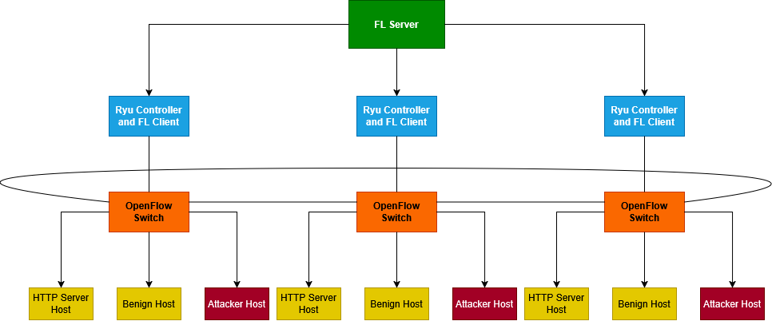

# Federated Learning with SDN Controllers using Mininet and Ryu

This project implements a  **Federated Learning (FL)** model within a **Software-Defined Networking (SDN)** environment. Each SDN controller acts as an independent FL client: it captures live network traffic, builds a local labeled dataset, trains a neural network on it, and collaborates with the other controllers to aggregate a global model — without ever sharing raw packet data.

The infrastructure relies on **Mininet** for network emulation, **Ryu** as the SDN controller framework, and **Flower (flwr)** as the federated learning orchestration layer.

---

## Table of Contents

1. [Architecture Overview](#architecture-overview)
2. [Environment Setup](#environment-setup)
3. [Running the Demo](#running-the-demo)
4. [Output Files](#output-files)
5. [Visualizing Results](#visualizing-results)
6. [Feature Importance Analysis](#feature-importance-analysis)
7. [Notes](#notes)

---

## Architecture Overview




## Environment Setup

- **OS:** Linux (tested on Ubuntu 18.04.6 LTS)
- **Python:** 3.9 (Conda environment recommended)

### Python Dependencies

Install the following Python packages:
- Mininet;
- Ryu;
- Flower version: `1.17`;
- hping3

```bash
pip install pandas matplotlib torch torchmetrics torchvision
```

> ⚠️ Flower 1.17 is required. The client uses the `client_fn(context)` API introduced in recent Flower versions; older versions are not compatible.

---

## Running the Demo

Open **five terminal windows** for the 3-controller scenario (four for a 2-controller setup).

### Terminal 1 — FL Server


```bash
cd src
python3 server.py 3
```

Replace `3` with `2` if running a 2-controller experiment.

### Terminal 2 — Controller 1

```bash
cd /path/to/ryu/bin
python3 ryu-manager --observe-links src/controller1.py
```

Listens on OpenFlow port **6633** (default).

### Terminal 3 — Controller 2

```bash
cd /path/to/ryu/bin
python3 ryu-manager --observe-links --ofp-tcp-listen-port 6634 src/controller2.py
```

### Terminal 4 — Controller 3

```bash
cd /path/to/ryu/bin
python3 ryu-manager --observe-links --ofp-tcp-listen-port 6635 src/controller3.py
```

### Terminal 5 — Mininet Topology

```bash
cd src
sudo -E mn \
  --custom topo3Clients.py \
  --topo create_topo \
  --switch ovs \
  --controller=remote,ip=127.0.0.1,port=6633 \
  --controller=remote,ip=127.0.0.1,port=6634 \
  --controller=remote,ip=127.0.0.1,port=6635 \
  --arp --mac \
  --test none \
  --post=synfinudp.txt
```

Replace `synfinudp.txt` with another attack script as needed.

---

## Output Files

| File | Description |
|------|-------------|
| `networkdatasetcontroller<N>.csv` | Raw labelled packet dataset produced by controller N |
| `metrics_client_<N>.csv` | Per-round loss, accuracy, recall, precision, F1, and confusion matrix for client N |
| `server_metrics.csv` | Per-round distributed loss reported by the FedProx server |
| `dataset_distribution_client_<N>.png` | Pie charts of local train and global test class distributions |

---

## Visualizing Results

After training is complete, run:

```bash
cd src
python3 plot_results.py
```

The script automatically detects `metrics_client_*.csv` and `server_metrics.csv` in the current directory and generates the following plots (one set per training session detected):

| File | Content |
|------|---------|
| `plot_loss_accuracy_session<N>.png` | Client loss, client accuracy, and server distributed loss over rounds |
| `plot_recall_per_class_session<N>.png` | Per-class recall for each client over rounds |
| `plot_f1_per_class_session<N>.png` | Per-class F1-score for each client over rounds |
| `plot_precision_per_class_session<N>.png` | Per-class precision for each client over rounds |
| `plot_confusion_matrices_session<N>.png` | Row-normalised confusion matrix at the last round for each client |

Multiple training sessions are supported: a new session is detected every time the `round` column resets to 1 in the CSV (i.e., if you run the experiment more than once without clearing the metrics files).

---

## Feature Importance Analysis

An offline analysis using **Random Forest** (300 trees, balanced class weights) is available to understand which features matter most for each controller's local dataset:

```bash
cd src
python3 feature_importance_rf.py
```

This script requires the three `networkdatasetcontroller<N>.csv` files to exist. It trains a separate RF per controller on an 80/20 stratified split and produces three output figures:

| File | Content |
|------|---------|
| `fi_per_controller.png` | Horizontal bar chart of MDI feature importances with std. deviation, one panel per controller |
| `fi_ranking_comparison.png` | Heatmap and line chart comparing the importance rankings across all three controllers |
| `cm_per_controller.png` | Row-normalised confusion matrix for each controller's RF model |

---

## Notes

- **Port conflicts:** each Ryu instance must listen on a distinct OpenFlow TCP port (`6633`, `6634`, `6635`). The OVS bridge in Mininet must be configured with the matching `--controller` flags. Localhost is used.
- **`ip_proto` can be `None`:** non-IP packets (e.g., ARP) produce a `None` value for `ip_proto`. The feature validation step skips these packets rather than imputing a value.
- **Reproducibility:** a fixed `random_state=42` is used for all train/test splits and Random Forest training. The neural network training is not seeded, so FL results may vary slightly between runs.
